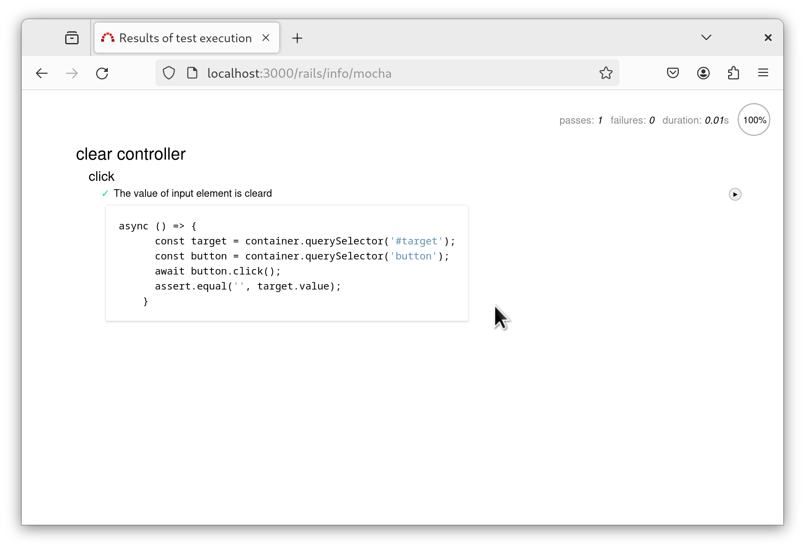

# importmap_mocha-rails

This plugin makes it easy to test ES modules with [importmap-rails](https://github.com/rails/importmap-rails) when using Rails 7 or later.
It integrates the [Mocha](https://mochajs.org/) JavaScript testing library (using [Chai](https://www.chaijs.com/) as the assertion library, [@mswjs/interceptors](https://github.com/mswjs/interceptors) as the mocking library) and runs tests for ES modules delivered with importmap in the browser.

# Installation

Assuming you have already installed importmap-rails with Rails 7, add the following to your Gemfile and run `bundle install`.

```ruby
group :test, :development do
  gem 'importmap_mocha-rails'
end
```

# Usage

Write your JavaScript tests in `test/javascripts` or `spec/javascripts`. One-to-one tests are named foo.test.js for a module named foo.js. Access `http://localhost:3000/rails/info/mocha` in the Rails testing or development environment to view the test results.

By default, importmap-rails manages ES modules under `app/javascript`, `app/assets/javascripts`, and `vendor/javascripts`.

# Example

controllers/clear_controller.js

```javascript
import { Controller } from "@hotwired/stimulus"

export default class extends Controller {

  static targets = ["clear"];

  clear(e) {
    this.clearTargets.forEach(o => { o.value = ''});
  }
}
```

controllers/clear_controller.spec.js

```javascript
import { assert } from "chai"
import { Application } from "@hotwired/stimulus"
import ClearController from 'controllers/clear_controller'

const html = `<div data-controller="clear">
  <input id="target" type="text" value="foo" data-clear-target="clear">
  <button data-action="clear#clear">test</button>
  </div>`

describe('clear controller', () => {

  let container;

  before(async () => {
    container = document.getElementById('container')
    const app = Application.start(container);
    await app.register('clear', ClearController);

    container.insertAdjacentHTML('afterbegin', html)
  });

  after(() => {
    const clone = container.cloneNode(false);
    container.parentNode.replaceChild(clone, container);
  });

  describe('click', () => {
    it('The value of input element is cleard', async () => {
      const target = container.querySelector('#target');
      const button = container.querySelector('button');
      await button.click();

      assert.equal('', target.value);
    });
  });
});
```



# Configuration

* config.importmap_mocha_style: The style of the test code, `"bdd"` or `"tdd"`. Default is `"bdd"`.
* config.importmap_mocha_path: The location where the test code is stored. Default is `test/javascripts` and `spec/javascripts`.
* config.importmap_mocha_scripts: The scripts to be loaded globally. e.g. `['jquery.js']`.

# Author

Takashi Kato tohosaku@users.osdn.me

# License

MIT
